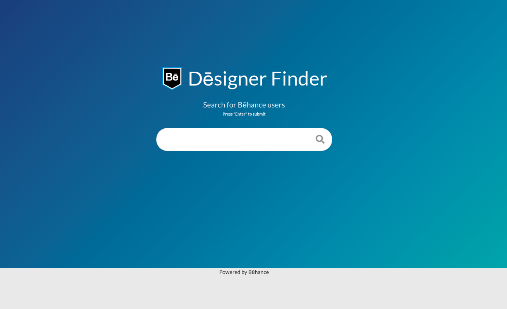
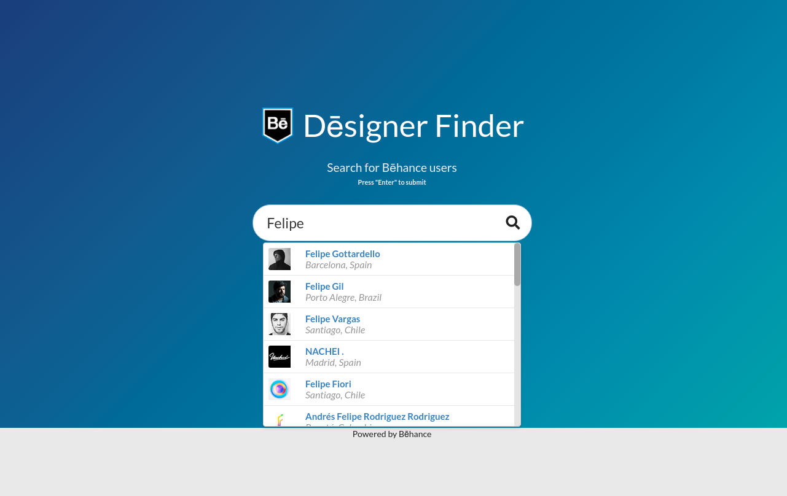
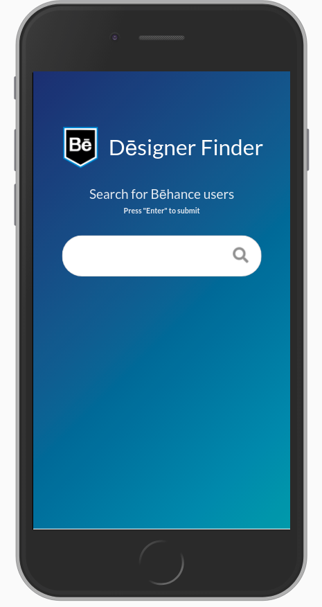
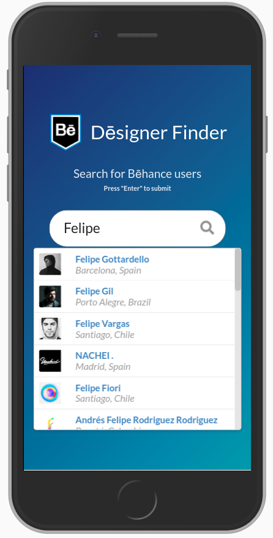
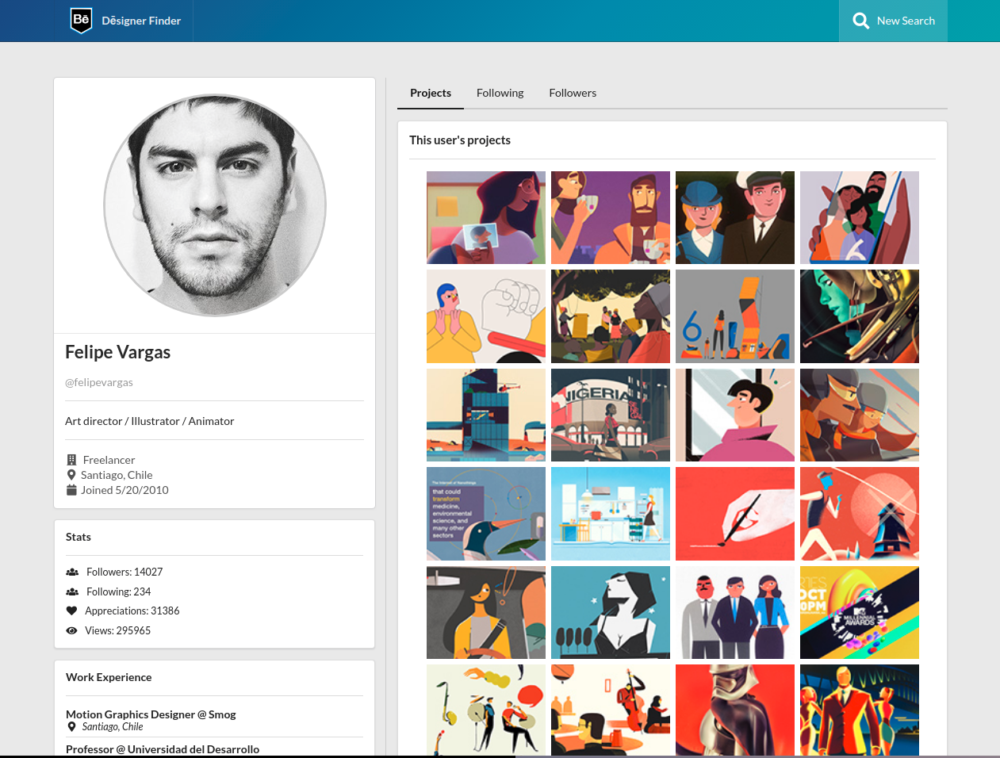
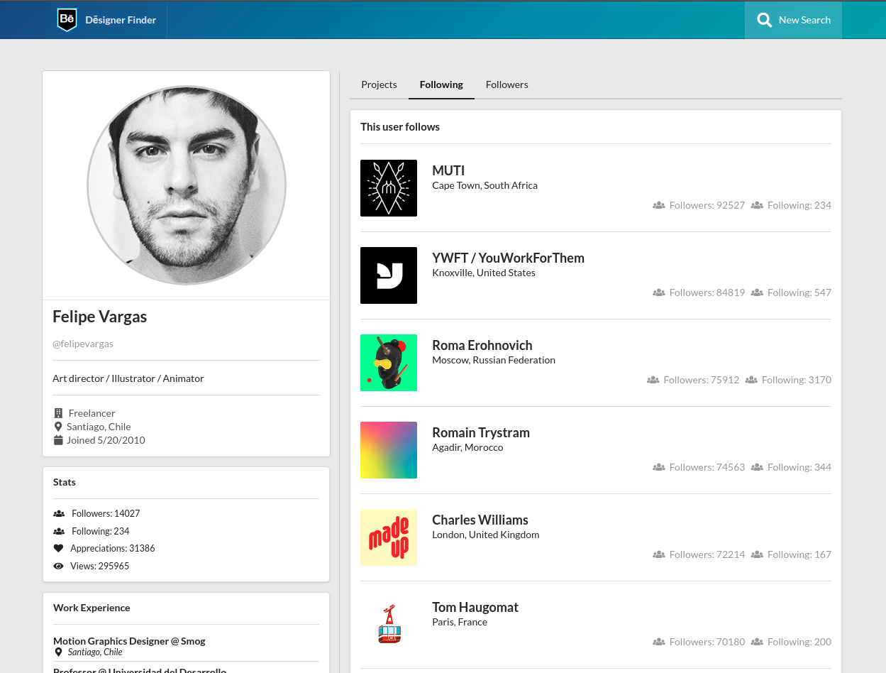
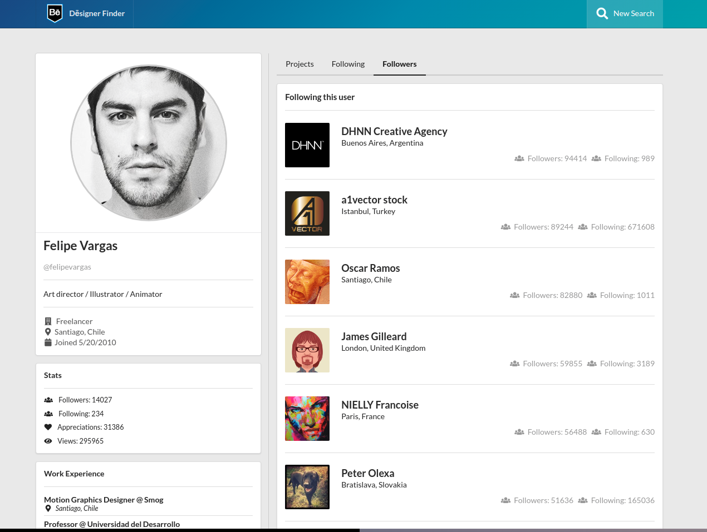
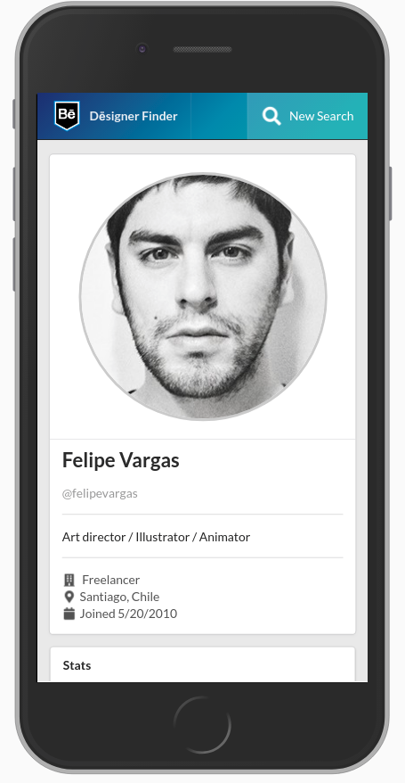
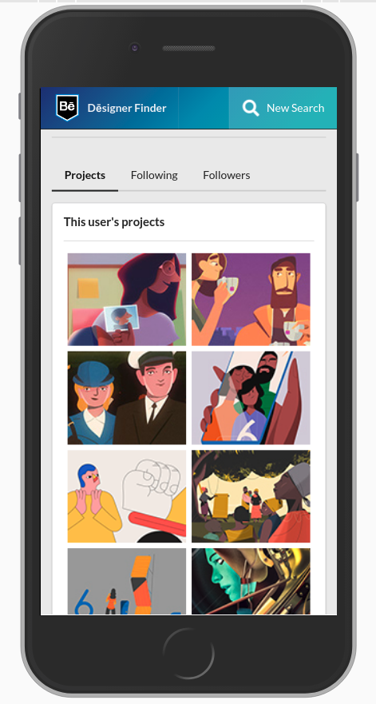
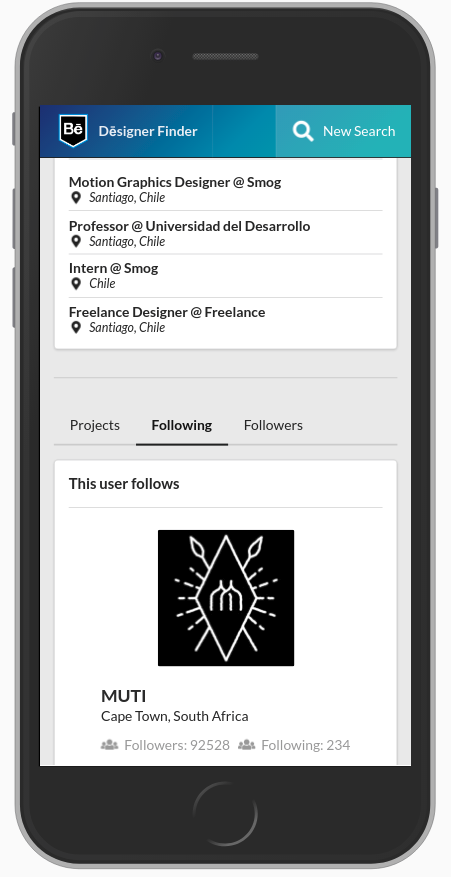

# Dealer Inspire Front End Code Challenge

Hey - welcome to the Dealer Inspire Javascript Code challenge.  We're glad you're here.

## Getting Started

First of all, you'll need to fork this repository to somewhere else.  Make sure your code is publicly available in a git repository when you're done.   (Like Bitbucket or GitHub. If you're super-nerdy and host your own public repo, just make sure the server is up 24/7 - our code-review monkeys like to work in the middle of the night.)

You don't have to host a working copy of the code, we'll be checking it out locally to review it. That's a good reminder - we'll need you to update this document with instructions on how to run your project locally (whether it's a yarn, npm or ng style command, we're fine - just tell us with one!)

## The Challenge

Behance is one of the most popular websites for front-end and art portfolios.  For this code challenge, you'll be using the Behance JSON API to build out a quick front-end for a search users and profile display website.  To get started, visit here: [Behance Developers](https://www.behance.net/dev).

- The first view of the app should have a search box where searches for users are executed
- When a user is chosen/found, the next view is an individual profile page for the user. The profile page should include:

	- basic information about the user (including stats)
	- a list of their projects with links to them (links should be exterior to your app and link directly to Behance)
	- a list of their work experience,
	- a preview of their followers and following lists.

## Expectations

You provide and code an original, usable, and contemporary design.

You use your favorite front-end javascript framework to create the REST API requests, but do **not** use the Behance JS library itself. (Normally we don't like to re-invent the wheel, but in this case, we want to see how you wrangle the JSON directly.)

You provide unit and/or end-to-end tests for your code.

# Challenge Implementation

## Overview

Thank you for the opportunity to complete this coding challenge as part of the DealerInspire hiring process. 
This was an original concept for a coding exercise, and hopefully will demonstrate that my skills and ability are well-
suited for this position.

The name of my application is Dēsigner Finder. It consists of two main views. The home page contains a search input
component where you can enter a search term and press "Enter" to submit. Then, displayed underneath the search input, 
you'll notice a scrolling list of profiles Bēhance has returned as results. The list contains the profile avatar, name,
and location to assist you in choosing the correct one. Upon selecting one of the list items by clicking, you will be 
navigated to the profile details page for that user. This page contains the following information:

- Full name
- Username
- Occupation
- Job title
- User location (city and country)
- Their Bēhance join date
- Their Stats (follower and following count, appreciations, and views)
- Work experience
- A tab interface showing the following
    - Their projects, displayed as thumbnails with a pop-up displaying the project name. When clicked, a new window
    will open to the project details page on the Bēhance site
    - The top 20 users they follow ordered by their number of appreciations (e.g. likes) descending
    - The top 20 users following them, also ordered by their number of appreciations descending
        - Followers and following users contain that user's avatar, their location, and their counts of followers and 
        following
        - Clicking a follow will take you to that user's page on Bēhance

Rather than simply building a React client appliation that consumes data from the Bēhance API, I decided to go another
route. Of course, the first thing that I'd like to mention is that I would never expand the scope of a feature or project
in this fashion at work. My reason for doing so is that I wanted to demonstrate my knowledge of Node.js in a server-side
environment, so I decided to implement an Express.js server backend using Apollo Server to implement a GraphQL endpoint
as the data source for the React application. The GraphQL server, in turn, consumes the Bēhance API using the Apollo
Server RESTDataSource to create a BehanceAPI service. I hope you will find this to be an interesting and appropriate
implementation of the DealerInspire Bēhance coding challenge!

### Observations

As I worked with the Bēhance API, I noticed that the `/user` endpoint does return inconsistent data for text queries. I 
confirmed this to be the case using plain HTTP requests via the Postman client and CURL. They also seem to have frequent
lapses in operation, and occasionally would have extremely long (10-20 second) response times, so I'm hoping you will 
take this into account when putting the application through its paces ;-)

## Architecture

As mentioned before, this coding challenge was implemented as a client/server application, with the server sitting in
front of the Bēhance API as an additional layer. The advantage to this approach is REST is schemaless, GraphQL provides 
an introspectable way to communicate to clients what Types and operations are available. It also provides flexibility 
to allow transformations of the data on the server, before being sent to the client, and allows server-side request 
caching (not implemented here), to manage API resource usage limits, for example.

### Server Side

As mentioned, the server is an Express.js server using ApolloServer for GraphQL. There's no middleware or authentication
to speak of, aside from CORS, as it wasn't really necessary. The server uses the Apollo RESTDataSource to implement a 
REST client for the Bēhance API.

### Client Side

Dēsigner Finder uses a React application (bootstrapped by create-react-app) along with the SemanticUI React component
library and the ApolloClient library for GraphQL requests.

## Features

#### Server 

- GraphQL server
- Bēhance API client with retry feature that will, uh, re-try API requests up to 3 times in the event of e.g. a network
failure
- Unit tests covering main business logic and utils
- Scalable and maintainable application structure
- ES2017 features including transpiling with Babel, using stage-2 presets
- Linting with eslint using google style rules

#### Client

- GraphQL client
- Service workers implementing application caching 
- Component-centric code splitting to reduce load time by breaking bundle into pieces and loading asynchronously
- Clean, attractive, responsive design
- Some unit tests (admittedly, this is an area where I could refine and hone my skills)

## How to Use

The first step is to copy `./server/.env.dist` to `./server/.env` (`mv ./server/.env.dist ./server.env`) and enter a 
Bēhance API key (e.g. `NdTKNWys9AdBhxMhXnKuxgfzmqvwkg55`). Normally I would not commit an API key, but in this case... 

#### Server

Invoke npm scripts from the `./server` directory

- Install dependencies: `npm i`
- Start server: `npm start`
- Start in dev mode, with hot reloading and debugging output: `npm run dev`
- Run tests: `npm t`

#### Client

Invoke npm scripts from the `./client` directory

- Install dependencies: `npm i`
- Build production bundle: `npm run build`
- Build production bundle and serve locally: `npm run serve:build`
- Run in dev mode: `npm start`
- Run tests: `npm t`

## Screeenshots

### Home Page

### Profile Page

